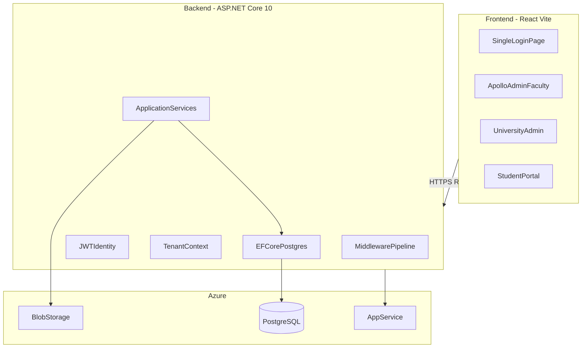
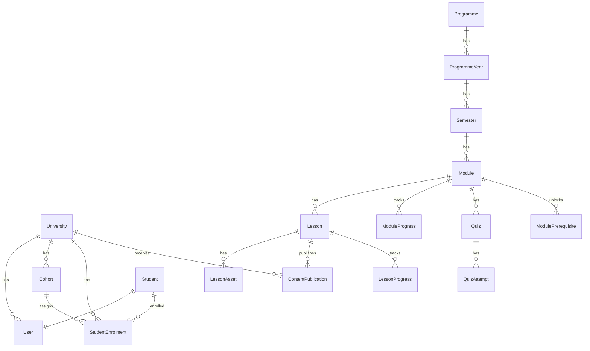

# CareTrack LMS — Phase 1 Implementation Plan

## Architecture overview



**Core principle:** One app, one login. Email resolves `User` → `Role` + `UniversityId` (nullable for Apollo users). Every query is scoped by tenant unless role is Apollo Admin/Faculty with cross-tenant permission.

---

## Monorepo layout

```
ApolloLearning/
├── src/
│   ├── CareTrack.Api/              # Controllers, Program.cs, middleware
│   ├── CareTrack.Application/      # Services, DTOs, validators, interfaces
│   ├── CareTrack.Domain/           # Entities, enums, domain exceptions
│   └── CareTrack.Infrastructure/   # DbContext, Identity, Blob, email
├── web/
│   └── caretrack-web/              # React + Vite + shadcn + GSAP
├── tests/
│   ├── CareTrack.UnitTests/
│   └── CareTrack.IntegrationTests/
├── docker-compose.yml              # Local Postgres
└── CareTrack.sln
```

---

## Multi-tenancy strategy

Use **shared database, row-level isolation** via `UniversityId` on tenant-owned tables.

| Data type | Isolation |
|-----------|-----------|
| Universities, programmes, modules, lessons | Apollo-owned; publish links to universities |
| Students, cohorts, enrolments, progress | `UniversityId` required |
| Content publish | Junction table `ContentPublication(lessonId, universityId \| null=All)` |
| Reports | Filtered in Application layer by caller's role + tenant |

**Tenant resolution:** JWT claims include `sub`, `role`, `universityId`. `ITenantContext` (scoped per request) reads claims; middleware rejects cross-tenant access at service level.

**Apollo users:** `UniversityId = null`; Faculty scoped to content they create; Admin sees all universities.

---

## Domain model (Phase 1 entities)



**Key enums:** `UserRole` (ApolloAdmin, ApolloFaculty, UniversityAdmin, Student), `ContentStatus` (Draft, PendingReview, Published), `EnrolmentStatus` (Invited, Active, Suspended), `LessonProgressStatus`.

**Phase 2 placeholder:** Add `Supervisor`, `Rotation`, `LogbookEntry` tables later — no schema coupling in Phase 1.

---

## Authentication and authorization

**Stack:** ASP.NET Identity + JWT Bearer (confirmed).

**Login flow:**
1. `POST /api/v1/auth/login` — email + password
2. Identity validates; Application loads user + role + university
3. JWT issued with claims: `nameid`, `email`, `role`, `universityId`, `cohortId` (students)
4. Frontend stores token; Axios interceptor attaches `Authorization: Bearer`

**Invite flow:**
- University Admin / Apollo Admin creates user → `PasswordHash = null`, status `Invited`
- Email with activation link → `POST /api/v1/auth/activate` sets password → status `Active`

**Authorization:** Policy-based — `[Authorize(Roles = "UniversityAdmin")]` on controllers + service-level tenant checks (defense in depth).

---

## Backend — Clean Architecture layers

### Domain (`CareTrack.Domain`)
- Entities, value objects, `NotFoundException`, `ForbiddenException`, `ValidationException`, `ConflictException`
- Zero dependencies on Infrastructure/Api

### Application (`CareTrack.Application`)
- One interface + service per bounded context:
  - `IUniversityService`, `IProgrammeService`, `IContentService`, `IEnrolmentService`, `ILearningService`, `IAssessmentService`, `IReportingService`, `IAuthService`
- FluentValidation for all request DTOs
- Manual mapping extensions (hot paths) — skip AutoMapper initially

### Infrastructure (`CareTrack.Infrastructure`)
- `CareTrackDbContext` with global query filters for tenant where applicable
- ASP.NET Identity stores
- `AzureBlobStorageService` (local Azurite in dev)
- `EmailService` (SMTP dev / Azure Communication Services prod)
- Npgsql + connection pooling; indexes on all FK + filter columns

### Api (`CareTrack.Api`)
- Thin controllers, API versioning `/api/v1/...`
- Middleware order (per project rules):
  1. Exception handling → RFC 7807 `ProblemDetails`
  2. HTTPS / HSTS
  3. Response compression (Brotli + Gzip)
  4. CORS
  5. Rate limiting
  6. Auth → Authorization
  7. Output caching (GET reference data)
  8. Endpoints

**Exception middleware:** Map domain exceptions → 404/403/409/400; unhandled → 500 with Serilog structured log; never leak stack traces in Production.

---

## Performance target (100–200 ms)

| Technique | Where |
|-----------|-------|
| `.AsNoTracking()` + `.Select()` projection to DTOs | All read queries |
| Pagination on every list endpoint | Enrolment, reports, content library |
| Compiled queries for hot paths | Student dashboard, lesson list |
| Output caching | Programme structure, published module catalog |
| Response compression | Pipeline early |
| Batch progress events | Client sends heartbeat every 30s; server upserts in single row |
| DB indexes | `(UniversityId, CohortId)`, `(StudentId, LessonId)`, `(ModuleId, Status)` |
| Avoid N+1 | Single query with projection, no loop queries |
| Async I/O everywhere | No `.Result`/`.Wait()` |
| Connection pooling | Default Npgsql pool; `ServerGarbageCollection=true` in csproj |

**Target validation:** Integration tests with `WebApplicationFactory` assert p95 < 200ms on dashboard + lesson list with seeded data.

---

## API endpoints by flow

### Flow 0 — Platform setup (Apollo Admin)
| Method | Route | Purpose |
|--------|-------|---------|
| POST | `/universities` | Onboard university |
| GET/PUT | `/universities/{id}` | Manage university |
| POST | `/programmes` | Create programme structure |
| POST | `/programmes/{id}/years/{y}/semesters/{s}/modules` | Module slots |
| POST | `/users/university-admins` | Create + invite univ admin |

### Flow 1 — Content (Apollo Faculty)
| Method | Route | Purpose |
|--------|-------|---------|
| GET | `/content/modules` | Module picker |
| POST | `/content/lessons` | Create lesson (Draft) |
| POST | `/content/lessons/{id}/assets` | Upload PDF/video → Blob |
| PATCH | `/content/lessons/{id}/status` | Draft → PendingReview → Published |
| POST | `/content/lessons/{id}/publish` | Body: `{ universityIds: [] \| null }` |
| GET | `/content/lessons/{id}/review` | Coordinator approve |

### Flow 2 — Enrolment (University Admin)
| Method | Route | Purpose |
|--------|-------|---------|
| POST | `/enrolments/students` | Single student |
| POST | `/enrolments/students/import` | CSV bulk upload |
| GET | `/enrolments/students` | Paginated list (tenant-scoped) |
| POST | `/cohorts` | Create cohort (Year/Sem) |

### Flow 3 — Student learning
| Method | Route | Purpose |
|--------|-------|---------|
| GET | `/students/me/dashboard` | Courses, progress, notices |
| GET | `/students/me/modules/{id}` | Module + lessons + lock state |
| GET | `/students/me/lessons/{id}` | Lesson content + assets |
| POST | `/students/me/lessons/{id}/progress` | Video heartbeat / completion |
| POST | `/students/me/lessons/{id}/complete` | Mark complete (≥90%) |

### Flow 4 — Assessment
| Method | Route | Purpose |
|--------|-------|---------|
| GET | `/students/me/modules/{id}/quiz` | Start quiz |
| POST | `/students/me/quizzes/{id}/attempts` | Submit answers |
| GET | `/students/me/quizzes/{id}/attempts` | History + retry rules |
| POST | `/assessments/offline-results` | Faculty manual OSCE/viva marks |
| POST | `/students/me/semester/complete` | Trigger progression check |

### Flow 5 — Monitoring
| Method | Route | Purpose |
|--------|-------|---------|
| GET | `/reports/university/students` | Univ admin: cohort progress, at-risk |
| GET | `/reports/university/export` | Excel/PDF |
| GET | `/reports/apollo/universities` | Cross-university comparison |
| GET | `/reports/apollo/content-performance` | Module completion rates |

---

## Frontend structure (`web/caretrack-web`)

**Stack:** React 19 + Vite + TypeScript + shadcn/ui + Lucide + TanStack Query + React Router + Zod + GSAP

```
web/caretrack-web/src/
├── app/                    # Router, providers, auth guard
├── features/
│   ├── auth/               # Login, activate account
│   ├── apollo/             # Universities, programmes, content library
│   ├── university/         # Enrolment, cohort management
│   ├── student/            # Dashboard, lesson player, quiz
│   └── reports/            # Role-scoped dashboards
├── components/ui/          # shadcn primitives
├── lib/                    # api-client, auth-store, tenant-utils
└── animations/             # GSAP hooks (page transitions, progress bars)
```

**Role-based routing:** After login, redirect by `role`:
- `ApolloAdmin|ApolloFaculty` → `/apollo/*`
- `UniversityAdmin` → `/university/*`
- `Student` → `/learn/*`

**Lesson player:** Video.js or native `<video>` with 30s progress heartbeat debounced to API. PDF via iframe or react-pdf. GSAP for module unlock animations and dashboard micro-interactions.

**Design:** Single login at `/login` (caretrack.in). shadcn default theme with Apollo brand colors configurable via CSS variables.

---

## Database (PostgreSQL)

Connection string (local dev in `appsettings.Development.json`):
```json
"ConnectionStrings": {
  "DefaultConnection": "Host=localhost;Port=5432;Database=lms;Username=postgres;Password=Password@1"
}
```

- EF Core migrations in `CareTrack.Infrastructure`
- Seed data: Apollo admin, sample programme (B.Sc Allied Health), Meridian University
- `docker-compose.yml` for local Postgres 16
- Production: Azure Database for PostgreSQL Flexible Server

**Critical indexes:**
- `Users(Email)` unique
- `StudentEnrolments(UniversityId, CohortId)`
- `LessonProgress(StudentId, LessonId)` unique
- `ContentPublications(LessonId, UniversityId)`
- `ModulePrerequisites(ModuleId, PrerequisiteModuleId)`

---

## Azure deployment (Phase 1)

| Component | Azure service |
|-----------|---------------|
| API | App Service (Linux, .NET 10) |
| Frontend | Static Web Apps or Blob + CDN |
| Database | PostgreSQL Flexible Server |
| Files | Blob Storage + SAS URLs for video/PDF |
| Secrets | Key Vault references in App Service |
| Email | Azure Communication Services Email |
| CI/CD | GitHub Actions: build → test → deploy |

Environment config via `appsettings.Production.json` + Key Vault — never commit secrets.

---

## Build order (6 phases — matches your suggestion)

### Phase 1.1 — Foundation (Auth + tenant + setup)
- Scaffold solution, Docker Postgres, EF migrations
- Identity + JWT + login/activate/invite email
- University + programme structure CRUD (Flow 0)
- Tenant middleware + global exception handler
- Frontend: login page, role redirect shell, Apollo university onboarding UI

### Phase 1.2 — Content management
- Lesson CRUD, Blob upload, draft/review/publish workflow
- Publish to all or selected universities
- Frontend: content library, file upload, publish modal

### Phase 1.3 — Enrolment
- CSV import (CsvHelper), cohort assignment, invite emails
- Tenant-scoped student list
- Frontend: enrolment table, bulk upload, manual add form

### Phase 1.4 — Student learning
- Dashboard (published content filtered by university + cohort semester)
- Lesson player, progress tracking, prerequisite unlock logic
- Frontend: dashboard, module tree with lock icons, lesson player + GSAP transitions

### Phase 1.5 — Quiz and assessment
- MCQ engine, timed attempts, auto-grade, retry rules (max 3 + cooldown)
- Offline result entry for faculty
- Semester completion + year progression logic
- Certificate PDF generation (QuestPDF or similar)

### Phase 1.6 — Reports and monitoring
- University-scoped and Apollo-scoped report queries
- At-risk algorithm (e.g., progress < 40% mid-semester, no activity 7 days)
- Excel export (ClosedXML), PDF export
- Frontend: chart dashboards (recharts), export buttons

---

## Phase 2 (deferred — no Phase 1 work blocked)

- `Supervisor` role + hospital assignments
- Rotation scheduling, attendance, logbook sign-off
- Add tables and `/rotations/*` API namespace when ready

---

## Testing strategy

- **Unit tests:** Services with mocked repositories; validator tests
- **Integration tests:** `WebApplicationFactory` + Testcontainers Postgres
- **Key scenarios:** Tenant isolation (Univ A cannot see Univ B students), publish visibility, prerequisite unlock, quiz retry rules
- **Performance smoke:** Dashboard endpoint p95 under 200ms with 500 seeded students

---

## NuGet packages (flagged for approval)

| Package | Purpose |
|---------|---------|
| `Npgsql.EntityFrameworkCore.PostgreSQL` | Postgres EF provider |
| `FluentValidation.AspNetCore` | Input validation |
| `Serilog.AspNetCore` | Structured logging |
| `Asp.Versioning.Mvc` | API versioning |
| `CsvHelper` | CSV enrolment import |
| `ClosedXML` | Excel export |
| `QuestPDF` | Certificate PDF |
| `Azure.Storage.Blobs` | File storage |

No AutoMapper initially — manual mapping keeps hot paths fast and explicit.

---

## First sprint deliverable (recommended start)

After plan approval, implement **Phase 1.1** end-to-end:
1. Monorepo scaffold + Docker Postgres
2. Domain entities for User, University, Programme, Role
3. JWT login + Apollo admin seed
4. One working screen: Apollo admin creates Meridian University + programme skeleton
5. Global exception middleware returning ProblemDetails
6. Frontend login → Apollo dashboard shell

This validates tenant foundation before content/enrolment work begins.
